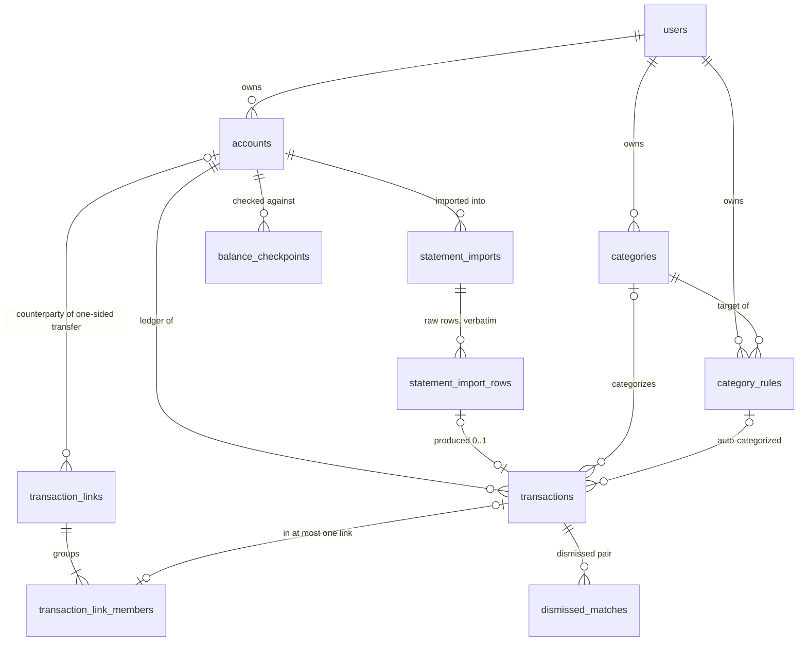

# FinanceTracker — Data Model (MVP)

Status: Draft v0.2
Last updated: 2026-08-23

## 1. Purpose and scope

This document is the SQL-layer design for the MVP scope frozen in [SPEC.md §10](SPEC.md) (FR-1 … FR-8).
It covers tables, columns, keys, constraints and indexes.

It does not cover the parser, the API, or JPA entity mapping.
Those are implementation decisions taken later, and nothing here should be read as prescribing them.

Everything in [SPEC.md §2](SPEC.md) is treated as settled input, not re-argued here.
Where this document makes its own choice, it is recorded in the decision log in §12 with a `DM-` prefix.
Spec decisions are referenced by their original `D-` prefix.

The per-source column facts that the import design is built against are in [STATEMENT_DATA_EXPLORATION.md](STATEMENT_DATA_EXPLORATION.md).

## 2. Conventions

These apply to every table and are not repeated in each section.

| Convention | Value | Reason |
| ---------- | ----- | ------ |
| Money | `BIGINT`, integer paise, always signed | D-08. Exact arithmetic, one conversion point at parse time |
| Sign | Money into the account is positive, money out is negative — for every account type | One rule instead of per-type special cases |
| Tenancy | Every domain table carries `user_id`, and foreign keys carry it too | D-16. Isolation later is a `WHERE user_id = ?`, and no child can point at another user's parent (DM-23) |
| Primary keys | `BIGINT GENERATED BY DEFAULT AS IDENTITY` | Single-writer app; no need for distributed ID generation |
| Fixed value sets | `TEXT` with a `CHECK` constraint | Native Postgres enums make adding a value a migration and irritate JPA |
| Timestamps | `TIMESTAMPTZ`, defaulting to `now()`. Every table has `created_at`; a table whose rows change also has `updated_at` | Stores an absolute instant, not a local wall-clock reading (DM-26) |
| Deletion | Categories and accounts are retired with `is_active`, never deleted | Deleting one would orphan historical transactions |
| Foreign keys | Composite, carrying `user_id`. `ON DELETE RESTRICT` on ledger and reference links; `CASCADE` only for a join child with its parent | A delete rule is a decision, not a default; a ledger row is never lost by cascade (DM-24) |

### 2.1 Naming

Column and table names use everyday words, not formal ones.
Examples: `source` rather than `provenance`, `transaction_type` rather than `nature`, `dedup_method` rather than `import_identity`.
This is DM-17 and it applies to anything added later.

The exception is vocabulary the spec and the source files already fix.
`txn_date`, `narration`, `balance_after_paise` and `needs_wants` are kept exactly as SPEC.md §4.1 writes them.
Renaming those would leave the schema and the spec using different words for the same thing, which is worse than a slightly formal word.

### 2.2 Tenant-carrying foreign keys

Every parent table adds `UNIQUE (user_id, id)`, and every foreign key to a user-owned parent is composite: it references `(user_id, id)`, not `id` alone.
So a child can never point at a row owned by another user — the mismatched `user_id` fails the key.
This makes "isolation is a `WHERE user_id = ?`" true at the schema level, not only in queries.
This is DM-23 and it applies to every foreign key listed below.

**Migration order.**
This is the widest change in the schema — it touches nearly every foreign key.
Write the base schema in one migration: each parent's `UNIQUE (user_id, id)` must exist before any child's composite key can reference it.
So a table's `UNIQUE (user_id, id)` and every `FOREIGN KEY (user_id, ...)` pointing at it belong in the same migration, added parent-first.
Do not add the plain single-column foreign keys first and convert them later; that is a second migration for no reason, and it leaves a window where cross-tenant references are possible.

## 3. Entity relationship diagram



Eleven tables in five groups:

| Group | Tables | Serves |
| ----- | ------ | ------ |
| Identity and accounts | `users`, `accounts` | FR-1, FR-8 |
| The ledger | `transactions` | FR-3, and the base of everything else |
| Import | `statement_imports`, `statement_import_rows` | FR-2 |
| Links between rows | `transaction_links`, `transaction_link_members`, `dismissed_matches` | FR-4, and §2.7 in v1.1 |
| Meaning and checking | `categories`, `category_rules`, `balance_checkpoints` | FR-5, FR-6, FR-7 |

## 4. Identity and accounts

### 4.1 `users`

One row in MVP.
It exists now only so every other table can carry `user_id` from day 1 (D-16).

| Column | Type | Notes |
| ------ | ---- | ----- |
| `id` | `BIGINT` | Primary key |
| `email` | `TEXT` | Unique |
| `display_name` | `TEXT` | |
| `created_at`, `updated_at` | `TIMESTAMPTZ` | |

No password or credential columns yet.
FR-8 is a separate piece of work and the auth mechanism is not chosen.
Adding those columns later is a cheap migration; guessing them now produces columns nobody uses.

### 4.2 `accounts`

A place money sits, or a debt that must be repaid (§2.1).
Four rows are seeded: HDFC Savings, SBI Savings, HDFC Millenia, Investments.

| Column | Type | Notes |
| ------ | ---- | ----- |
| `id` | `BIGINT` | Primary key |
| `user_id` | `BIGINT` | References `users` |
| `name` | `TEXT` | Unique per user |
| `type` | `TEXT` | `ASSET`, `LIABILITY`, `VIRTUAL` |
| `dedup_method` | `TEXT` | `ROW_FINGERPRINT`, `STATEMENT_BATCH`, `NONE` |
| `is_active` | `BOOLEAN` | |
| `created_at`, `updated_at` | `TIMESTAMPTZ` | |

**Virtual accounts are ordinary rows.**
Investments is `type = 'VIRTUAL'` and nothing else in the schema treats it specially.
When Payroll arrives in v1.1 (§2.8), it is one `INSERT` and no schema change.
This is what "MVP must not foreclose it" means in practice.

**`dedup_method` is its own column, not derived from `type`** (DM-07).
It selects which §4.1 identity scheme the importer applies:

| Value | Applies to | Identity |
| ----- | ---------- | -------- |
| `ROW_FINGERPRINT` | SBI Savings, HDFC Savings | The six-field tuple, hashed per row |
| `STATEMENT_BATCH` | HDFC Millenia | `(account, statement_date)`, whole batch replaced |
| `NONE` | Investments | Never imported from a statement |

Deriving it from `type` would be wrong the first time a non-card liability appears.
A loan account is a `LIABILITY` but would not use statement-scoped identity.
Two properties that vary independently get two columns.

## 5. The ledger

### 5.1 `transactions`

The main table.
Every other table either feeds it, describes it, or checks it against reality.

**Fact columns** — what the source said.
Frozen once the row is imported.

| Column | Type | Notes |
| ------ | ---- | ----- |
| `id` | `BIGINT` | Primary key |
| `user_id` | `BIGINT` | References `users` |
| `account_id` | `BIGINT` | References `accounts` |
| `txn_date` | `DATE` | |
| `txn_time` | `TIME` | Nullable. Only credit card rows carry a meaningful time |
| `amount_paise` | `BIGINT` | Signed, `CHECK (amount_paise <> 0)` |
| `narration` | `TEXT` | Nullable. Unwrapped and readable |
| `narration_normalized` | `TEXT` | Nullable. Fingerprint component, bank rows only |
| `balance_after_paise` | `BIGINT` | Nullable. Bank rows only — the card has no running balance |
| `source` | `TEXT` | `IMPORTED`, `MANUAL`, `OFF_STATEMENT` |
| `statement_import_id` | `BIGINT` | Nullable. References `statement_imports` |
| `source_row_id` | `BIGINT` | Nullable, unique. References `statement_import_rows` |
| `source_row_fingerprint` | `TEXT` | Nullable. SHA-256 hex of the §4.1 tuple |
| `fingerprint_version` | `SMALLINT` | Nullable. Which normalizer produced the fingerprint (D-20) |

**Interpretation columns** — what the owner decides it means.
Editable for every row, forever.

| Column | Type | Notes |
| ------ | ---- | ----- |
| `transaction_type` | `TEXT` | `EXPENSE`, `INCOME`, `TRANSFER`, `UNCLASSIFIED`. `NOT NULL`, default `UNCLASSIFIED` (DM-20) |
| `category_id` | `BIGINT` | Nullable. References `categories` |
| `category_source` | `TEXT` | Nullable. `RULE` or `MANUAL` — how the category was set (DM-21) |
| `category_rule_id` | `BIGINT` | Nullable. The rule that set the category, if any. References `category_rules` |
| `needs_wants` | `TEXT` | Nullable. `NEED` or `WANT`, expenses only |
| `notes` | `TEXT` | Nullable |
| `created_at`, `updated_at` | `TIMESTAMPTZ` | |

### 5.2 Why one table and not two (DM-01)

§2.2 says imported financial facts are immutable and interpretation is editable.
The obvious reading is two tables joined one-to-one: an immutable facts table, and an editable interpretation table.
That reading is wrong, and the reason is in the same paragraph of the spec.

Manual entries are **fully editable, including their facts**, until they are merged with an imported row.
So the boundary is not "which column".
It is "which column, for a row with this `source` value".

A table split cannot express that.
The immutable table would still need editable rows for manual entries, which defeats the split, and it adds a join to every dashboard query plus a second write on every insert.

So: one table, with the rule enforced by a database trigger that checks `source` before allowing an update.
The two column groups above are a documentation and code-review boundary, not a physical one.

### 5.3 Why `transaction_type` is interpretation, not fact (DM-05)

The bank states that money left the account.
It does not state whether that was an expense or the owner moving money to their own investment account.
That judgement is the owner's, and it changes when a transfer match is confirmed in FR-4.

Facts are what was observed.
Interpretation is what the owner concluded.
`transaction_type` is a conclusion, so it stays editable even on imported rows.

An imported row starts as `UNCLASSIFIED` unless a rule (§8.2) sets its nature (DM-20).
`UNCLASSIFIED` counts as neither income nor expense, so a fresh import cannot move a report until the owner has reviewed it (SPEC §2.2, D-23).
The dashboard sums only `EXPENSE` and `INCOME` rows; `TRANSFER` and `UNCLASSIFIED` are left out.
The review inbox is the set of `UNCLASSIFIED` rows, plus `EXPENSE` and `INCOME` rows that still lack a category.
`UNCLASSIFIED` is also the reset target when a link is dissolved (§7.5).

### 5.4 Immutability is enforced by trigger (DM-02)

Two triggers on `transactions`:

- **Before update.** If `source = 'IMPORTED'`, any change to a fact column raises an exception.
  `source` itself can never change, on any row.
- **Before delete.** An `IMPORTED` row can only be deleted when its statement import is already marked `REPLACED`.
  A row that is still a transfer-link member cannot be deleted at all: the `ON DELETE RESTRICT` on `transaction_link_members` (§7.1) blocks it until the link is resolved (§7.5).

The second trigger exists because whole-batch replacement (§4.1) is a real delete of imported rows.
It is the only allowed way to delete an imported row, so the database checks that this is what is actually happening rather than trusting the caller.

The alternative is enforcing this in the Spring service layer only.
That was rejected for the same reason SPEC.md §4.1 gives for the dedup constraint: the database check survives application bugs, bulk updates, and a manual `psql` session.
For a personal finance ledger, "imported facts are provably unchanged" should be a property of the data, not a property of the code that happened to write it.

The cost is real and worth stating.
Trigger logic is invisible from the Java code, and a developer who has not read this document will be surprised by the exception.
Mitigation is that the exception messages name the rule directly, and that both triggers are covered by tests.

### 5.5 Category correctness is a foreign key, not a check (DM-06)

`categories` carries `UNIQUE (user_id, id, kind)`, and `transactions` declares:

```sql
FOREIGN KEY (user_id, category_id, transaction_type) REFERENCES categories (user_id, id, kind)
```

The key carries `user_id`, so a row can only use a category owned by the same user (DM-23).
Category `kind` values are deliberately the same words as `transaction_type` values.
These rules follow with no trigger and no application code:

- An `EXPENSE` row can only reference a category whose `kind` is `EXPENSE`.
- An `INCOME` row can only reference an `INCOME` category.
- A `TRANSFER` row can never have a category at all, because no category has `kind = 'TRANSFER'`.
- An `UNCLASSIFIED` row can never have a category either, for the same reason — no category has that `kind`.

The transfer rule is the one that matters most.
It is the schema-level guarantee behind §2.2's "transfers must never appear in spend/income reports".
A transfer physically cannot carry a category, so it cannot appear in a category rollup.

Refunds work correctly under this too.
A refund is a negative expense in its original category (§2.3), so `transaction_type = 'EXPENSE'` with a negative `amount_paise`, and the foreign key is satisfied.

### 5.6 Row-level constraints

| Constraint | Rule |
| ---------- | ---- |
| `chk_imported_has_source` | An `IMPORTED` row must have a statement import, a source row, and a narration |
| `chk_non_imported_has_no_source` | A `MANUAL` or `OFF_STATEMENT` row must have none of the import columns and no balance |
| `chk_fingerprint_versioned` | `source_row_fingerprint` and `fingerprint_version` are both set or both empty |
| `chk_needs_wants_expense_only` | `needs_wants` is only allowed on `EXPENSE` rows |
| `chk_category_source_paired` | `category_source` and `category_id` are both set or both empty; `category_rule_id` is set only when `category_source = 'RULE'` |

## 6. Import

### 6.1 `statement_imports`

One row per uploaded file (§4).

| Column | Type | Notes |
| ------ | ---- | ----- |
| `id` | `BIGINT` | Primary key |
| `user_id`, `account_id` | `BIGINT` | |
| `source_filename` | `TEXT` | |
| `file_sha256` | `TEXT` | Hash of the whole file, for spotting an identical re-upload early |
| `statement_date` | `DATE` | Nullable. Credit card statements only |
| `period_start`, `period_end` | `DATE` | Nullable |
| `status` | `TEXT` | `HELD`, `COMMITTED`, `REPLACED` |
| `created_at`, `updated_at`, `committed_at` | `TIMESTAMPTZ` | `updated_at` moves with the status change |

`status` records what happened to the file:

| Status | Meaning |
| ------ | ------- |
| `HELD` | The balance chain check of D-21 failed. Rows are stored, no transactions created |
| `COMMITTED` | Transactions were created from this file's new rows |
| `REPLACED` | A credit card statement was re-uploaded; this import was superseded |

`HELD` is what makes D-21 work.
A batch whose internal links break, or which does not join onto the stored history, is kept for review instead of being discarded or committed.
The owner can see the file, and the raw rows, without the ledger being touched.

### 6.2 `statement_import_rows`

The raw source rows, verbatim.
This is the audit trail required by §4 and FR-2, and it is kept permanently.

| Column | Type | Notes |
| ------ | ---- | ----- |
| `id` | `BIGINT` | Primary key |
| `user_id`, `statement_import_id` | `BIGINT` | |
| `row_number` | `INT` | Position in the file. Unique within the import |
| `raw_cells` | `JSONB` | Cell values exactly as read |
| `row_status` | `TEXT` | Nullable. `NEW`, `DUPLICATE`, `NEEDS_REVIEW` |
| `related_transaction_id` | `BIGINT` | Nullable. The existing row a duplicate matched, or the near-miss counterpart |
| `created_at`, `updated_at` | `TIMESTAMPTZ` | `updated_at` moves with `row_status`; the raw cells never change |

**`raw_cells` is untouched.**
SBI's mid-word line break is stored exactly as the bank wrote it, even though the transaction stores the unwrapped narration.
HDFC's numeric cells are stored with full precision as read.
If the normalizer is ever found to be wrong, the original data is still here to re-derive from.

**`row_status` makes FR-2's counts a query.**
The post-import summary of new, duplicate and needs-attention counts is a `GROUP BY row_status` over this table.
Storing the three counts on `statement_imports` would be a second copy of the same information, and copies drift.

**Traceability is a foreign key.**
`transactions.source_row_id` points at the exact raw row that produced it, with a unique constraint so one raw row cannot produce two transactions.
"Every transaction is traceable to its source line" is therefore enforced, not merely intended.

Raw rows are protected by two triggers, matching §5.4: content never changes, and rows can only be deleted while the import is still `HELD`.

### 6.3 Deduplication (DM-08)

D-20 fixed the identity rules.
This is how they are stored.

**Bank accounts.**
The six fields of §4.1 are hashed into `source_row_fingerprint`, with a partial unique index:

```sql
CREATE UNIQUE INDEX ux_transactions_fingerprint
    ON transactions (source_row_fingerprint)
    WHERE source_row_fingerprint IS NOT NULL;
```

Three points about this:

- `user_id` and `account_id` are inside the hash, so a unique index on the fingerprint alone is equivalent to uniqueness of the full tuple.
- The index is partial because manual rows and credit card rows have no fingerprint.
  Without the `WHERE`, the index would carry an entry for every such row for no benefit.
- `narration_normalized` and `balance_after_paise` stay as plain columns beside the hash, so a fingerprint can be recomputed and debugged without re-reading the source file.

`fingerprint_version` is what makes a normalizer change safe.
Changing the normalization rules means writing a new version number and backfilling.
Fingerprints of different versions are never compared, so old and new rows cannot silently stop matching each other.

**Credit cards.**
No row-level fingerprint at all.
Identity is the statement, enforced one level up:

```sql
CREATE UNIQUE INDEX ux_statement_imports_cc_statement
    ON statement_imports (user_id, account_id, statement_date)
    WHERE status = 'COMMITTED' AND statement_date IS NOT NULL;
```

At most one committed import per statement.
Re-uploading marks the old import `REPLACED`, deletes its transactions, and inserts a new import.
Any transfer link that used a deleted transaction is dissolved first and its surviving side returned to the inbox (§7.5).
The replaced import and all its raw rows are kept.
This is why the delete trigger in §5.4 has its one exception.

## 7. Links between rows

### 7.1 `transaction_links` and `transaction_link_members`

One mechanism, used for transfer matching now (§2.4, FR-4) and reimbursement netting in v1.1 (§2.7).
A link is a small group of transactions that together form one real-world event.

`transaction_links`:

| Column | Type | Notes |
| ------ | ---- | ----- |
| `id` | `BIGINT` | Primary key |
| `user_id` | `BIGINT` | |
| `link_type` | `TEXT` | `TRANSFER`, `REIMBURSEMENT` |
| `counterparty_account_id` | `BIGINT` | Nullable. One-sided transfers only |
| `created_at` | `TIMESTAMPTZ` | |

`transaction_link_members`:

| Column | Type | Notes |
| ------ | ---- | ----- |
| `link_id`, `transaction_id` | `BIGINT` | Composite primary key |
| `user_id` | `BIGINT` | |
| `created_at` | `TIMESTAMPTZ` | When the membership was formed |

A `UNIQUE` constraint on `transaction_id` alone means a transaction belongs to at most one link.
`link_id` references `transaction_links` `ON DELETE CASCADE`, so deleting a link removes its members.
`transaction_id` references `transactions` `ON DELETE RESTRICT`, so a member transaction cannot be deleted until its link is resolved (§7.5).

**No role or direction column.**
The members' signed amounts already say which side paid and which received.
A `role` column would be a second copy of information the amounts carry, and the two could disagree.

How the three cases map onto the same two tables:

| Case | Members | `counterparty_account_id` |
| ---- | ------- | ------------------------- |
| Matched transfer (HDFC → SBI) | 2, opposite signs | Empty |
| Credit card bill payment | 2, opposite signs | Empty |
| One-sided transfer (→ Investments) | 1 | The Investments account |
| Reimbursement, v1.1 | 1 expense + n repayments | Empty |

The v1.1 case needs no migration.
That was the requirement.

`CHECK (link_type = 'TRANSFER' OR counterparty_account_id IS NULL)` stops a reimbursement from carrying a counterparty, which would be meaningless.

### 7.2 One-sided transfers create no mirror row (DM-11)

FR-4 allows marking a single row as a transfer to Investments.
Only one statement row exists, because only one account produced a statement.

Two designs were considered.

**Chosen.** The link has one member and stores `counterparty_account_id`.
No row is created inside Investments.
The Investments balance and the "Invested this month" figure of §2.6 are computed by summing these links, behind a database view so callers see a normal balance query.

**Rejected.** Confirming creates a second, synthetic transaction inside Investments and links the pair, so every account's balance is uniformly the sum of its rows.

The rejected design is more uniform to query and worse to own.
The synthetic row needs a `source` value that is not true — it was neither imported nor entered by the owner.
If the link is undone, something must remember to delete it.
It would appear in transfer and merge suggestion queries unless excluded everywhere, and each such exclusion is a place to forget.

The chosen design keeps one property that is worth the extra view: **every row in `transactions` corresponds to something that actually happened.**

This is not the same as v1.1's off-statement payroll entries.
Those are real events that never passed through a bank statement, so `source = 'OFF_STATEMENT'` describes them accurately.
They fit this same link mechanism with no change.

### 7.3 `dismissed_matches`

| Column | Type | Notes |
| ------ | ---- | ----- |
| `id` | `BIGINT` | Primary key |
| `user_id` | `BIGINT` | |
| `match_type` | `TEXT` | `TRANSFER`, `MERGE` |
| `transaction_id_a`, `transaction_id_b` | `BIGINT` | `CHECK (a < b)` |
| `dismissed_at` | `TIMESTAMPTZ` | |

**Suggestions are not stored** (DM-12).
A transfer suggestion is "same absolute amount, opposite signs, within 3 days, different accounts, neither already linked".
That is a query over the current ledger.
Storing the results would produce a table that goes stale on every import and every confirmation.

A dismissal is different.
It is the owner saying "these two are not the same event", and nothing in the ledger implies it.
So dismissals are stored, and the suggestion query excludes dismissed pairs.

`CHECK (transaction_id_a < transaction_id_b)` forces one canonical ordering, so the same pair cannot be stored twice in mirrored form.
A `UNIQUE (user_id, match_type, transaction_id_a, transaction_id_b)` then stops an exact duplicate as well, and serves the lookup that excludes dismissed pairs from suggestions (DM-26).
`match_type` is inside the key because the same pair can be dismissed as a `TRANSFER` and still be a valid `MERGE` question.
Both foreign keys cascade on delete, because a dismissal referring to a deleted row is meaningless.

The FR-5 review inbox is also a query, not a table — the set defined in §5.3.

### 7.4 Manual merge deletes the draft (DM-13)

FR-3's merge, when the owner confirms that a manual entry and an imported row are the same purchase:

1. Copy the interpretation columns from the manual row onto the imported row.
2. If the manual row is a transfer-link member, move that membership to the imported row (§7.5).
3. Delete the manual row.

The imported row's facts win, exactly as §2.2 requires.
The manual row is deleted rather than kept with a "superseded by" pointer, because a manual entry is the owner's own placeholder, not source data.
There is no audit obligation to a note the owner wrote to themselves, and keeping dead rows means every report needs a filter to exclude them.

### 7.5 Deleting a transaction that is in a link (DM-22)

A transaction is deleted in only two ways: a manual merge (§7.4) or a whole-batch replace (§6.3).
If it is a transfer-link member, the `ON DELETE RESTRICT` on `transaction_link_members` (§7.1) blocks the delete until the link is dealt with.
The two deletes need opposite handling, because they mean different things.

**Manual merge — move the membership.**
The manual row and the imported row are the same real event, so the link follows the surviving row.
Re-point the membership from the manual row to the imported row, then delete the manual row.
This is safe because `UNIQUE (transaction_id)` holds — the imported row is not yet a member.

**Batch replace — dissolve the link.**
The replaced card row is being discarded, so its link is stale.
Before deleting the batch's rows, for each link they belong to: reset every surviving member's `transaction_type` to `UNCLASSIFIED`, then delete the link (its members cascade away).
The surviving bank row returns to the review inbox and is re-proposed when the new batch is imported.
No `dismissed_matches` row is written, because the owner did not reject the match — the data was replaced.

Both flows run in the service layer with tests (§10).
The database only guarantees, through `RESTRICT`, that neither delete can silently orphan a link.

## 8. Meaning and checking

### 8.1 `categories`

Flat, owner-defined, seeded from the SPEC §3 list and editable as data thereafter.
The seed count is not fixed here, because categories are user data, not schema.

| Column | Type | Notes |
| ------ | ---- | ----- |
| `id` | `BIGINT` | Primary key |
| `user_id` | `BIGINT` | |
| `name` | `TEXT` | Unique per user |
| `kind` | `TEXT` | `EXPENSE`, `INCOME` |
| `is_active` | `BOOLEAN` | Retire, never delete |
| `created_at`, `updated_at` | `TIMESTAMPTZ` | |

`UNIQUE (user_id, id)` lets other tables reference a category with a tenant-carrying key (DM-23), and `UNIQUE (user_id, id, kind)` is the target of the composite foreign key in §5.5.
Both are otherwise redundant, since `id` is already the primary key.

No hierarchy (D-12).

### 8.2 `category_rules`

The FR-5 rules engine, stored as data rather than code (§6).

| Column | Type | Notes |
| ------ | ---- | ----- |
| `id` | `BIGINT` | Primary key |
| `user_id` | `BIGINT` | |
| `account_id` | `BIGINT` | Nullable. Empty means every account |
| `narration_pattern` | `TEXT` | Case-insensitive substring |
| `category_id` | `BIGINT` | References `categories` |
| `priority` | `INT` | Lower value wins |
| `is_active` | `BOOLEAN` | |
| `created_at`, `updated_at` | `TIMESTAMPTZ` | |

`account_id` exists because of a measured fact, not a guess.
The exploration doc §5.5 shows the same real-world merchant appearing as an 8-character stub in SBI and as a full name in HDFC.
One shared pattern list cannot serve both, so rules can be scoped to one account.

Substring matching is deliberate.
Regular expressions would be more powerful and much easier to get subtly wrong in a user-editable field.
If substring matching proves insufficient during the first real categorization pass, a `match_type` column can be added then.

When the owner edits a rule, it re-runs only over rows whose `category_source = 'RULE'` and `category_rule_id` is this rule (§5.1, DM-21).
A category the owner set by hand (`category_source = 'MANUAL'`) is never overwritten by a rule change.

### 8.3 `balance_checkpoints`

FR-7 and D-13.

| Column | Type | Notes |
| ------ | ---- | ----- |
| `id` | `BIGINT` | Primary key |
| `user_id`, `account_id` | `BIGINT` | |
| `as_of_date` | `DATE` | |
| `actual_balance_paise` | `BIGINT` | The real balance the owner read from the bank |
| `note` | `TEXT` | Nullable |
| `created_at`, `updated_at` | `TIMESTAMPTZ` | Unique on `(user_id, account_id, as_of_date)` |

Only the entered balance is stored.
Drift against the derived balance is a subtraction done when the dashboard is rendered.
Storing the drift would be storing the answer to a question whose inputs change on the next import.

`actual_balance_paise` uses each account's natural reading: assets as the bank states the balance, liabilities as a positive amount owed.

## 9. Indexes

| Index | Purpose |
| ----- | ------- |
| `transactions (user_id, txn_date)` | FR-6. Monthly range scan, then aggregate by account and category |
| `transactions (account_id, txn_date, id)` | Derived balances, and joining a new import onto stored history (D-21) |
| `transactions (source_row_fingerprint)` partial unique | Dedup backstop (D-20) |
| `transactions (statement_import_id)` partial | Batch replacement, and tracing a batch's rows |
| `statement_imports (user_id, account_id, statement_date)` partial unique | One committed import per credit card statement |
| `statement_import_rows (statement_import_id, row_number)` unique | Row identity within a file |
| `dismissed_matches (user_id, match_type, transaction_id_a, transaction_id_b)` unique | Stops a duplicate dismissal and excludes dismissed pairs from suggestions (DM-26) |

The dashboard index is deliberately `(user_id, txn_date)` and not a wider covering index.
FR-6 reads one calendar month at a time, which is roughly 150 rows.
Postgres will range-scan those and aggregate in memory.
A wider index would make writes slower during import for no measurable read benefit at this size.

**One index deliberately not added.**
Near-miss detection in §4.1 looks for rows matching on account, date, amount and balance but differing in narration.
That is a distinct lookup with no supporting index.
At roughly 2,000 rows per year, the scan is instant.
Adding an index for it now would be paying a write cost for a read that is already fast.
Recorded here so the omission is understood as a decision rather than an oversight.

## 10. Rules enforced in the application

Three rules need to see two tables at once, which plain constraints cannot do.
They live in the service layer.
Each one gets a test — that is the price of not having the database enforce them.

| Rule | Why the database cannot check it |
| ---- | -------------------------------- |
| A bank-account import must set balance, normalized narration and fingerprint | Whether they are required depends on `accounts.dedup_method`, in another table |
| A `TRANSFER` row is in a transfer link, and every transfer link member is a `TRANSFER` row | Requires counting rows in `transaction_link_members` |
| A transfer link has exactly 1 member (one-sided) or 2 members (matched pair) | Cardinality across two tables |
| Deleting a transaction resolves its link first: move it on a merge, dissolve it on a replace (§7.5) | The correct action depends on why the row is being deleted, which no constraint can see |

The first could be enforced with a trigger.
It is not, because it would fire on every imported row during a 361-row import, and the import path already validates it once per batch as part of the D-21 chain check.

## 11. What this schema leaves room for, and does not build

§7 of SPEC.md lists the MVP non-goals.
None of the following has a table or a column in this design.

| Deferred item | Where it would attach | Cost when it arrives |
| ------------- | --------------------- | -------------------- |
| Splits (one transaction, many categories) | A `transaction_splits` child table; `transactions.category_id` becomes empty for split rows | New table, no change to existing columns |
| Off-statement payroll (§2.8, v1.1) | `source = 'OFF_STATEMENT'` already exists; a nullable `payroll_component` column would be added | One column, one seeded Payroll account |
| Reimbursement netting (§2.7, v1.1) | `link_type = 'REIMBURSEMENT'` already exists | Nothing. Reporting logic only |
| Budgets | A `budgets` table referencing `categories` | New table |
| Investment holdings, cost basis (v2) | New tables beside `accounts` | Investments stays a black box until then |
| TDS and gross salary (v2) | Needs payslip import, a separate source | Not modelled at all |

The pattern in the first three rows is deliberate.
Where a future feature needed a value in a fixed set — `OFF_STATEMENT`, `REIMBURSEMENT` — the value is present now, because it costs one word in a `CHECK` constraint and saves a migration later.
Where it needed a table or a column, nothing is built.

## 12. Decision log

| ID | Decision | Rationale |
| --- | -------- | --------- |
| DM-01 | One `transactions` table holding both facts and interpretation, not two tables joined one-to-one | The immutability boundary depends on `source`, not on which column. Manual rows have editable facts until merged (§2.2), which a table split cannot express. Avoids a join on every dashboard query |
| DM-02 | Immutability enforced by database triggers, not only in the service layer | Same reason SPEC.md §4.1 gives for the dedup constraint: the check survives application bugs, bulk updates and manual sessions. Cost is invisible-from-Java logic, mitigated by named exceptions and tests |
| DM-03 | Uniform sign convention: into the account positive, out negative, for every account type | Asset balance is a plain sum; card dues are the negated sum; transfer matching is "equal size, opposite signs". One rule instead of per-type branches |
| DM-04 | `TEXT` + `CHECK` for fixed value sets, not native Postgres enums | Adding a value is a one-line change, not an enum migration; avoids JPA enum mapping friction |
| DM-05 | `transaction_type` is interpretation, not fact — editable on imported rows | The bank states that money moved, not whether it was an expense or the owner's own transfer. FR-4 changes it on confirmation |
| DM-06 | Category correctness enforced by composite foreign key `(user_id, category_id, transaction_type) → categories (user_id, id, kind)` | Gives the §2.2 rule "transfers are never income or expense" as a schema guarantee: no category has kind `TRANSFER`, so a transfer physically cannot carry one. The `user_id` in the key also keeps a row from using another user's category (DM-23). No trigger needed |
| DM-07 | `accounts.dedup_method` is its own column, not derived from `type` | A future loan account is a `LIABILITY` but would not use statement-scoped identity. Two independent properties get two columns |
| DM-08 | Bank dedup is a partial unique index on `source_row_fingerprint`; credit card dedup is a partial unique index on `(user, account, statement_date)` for committed imports | Implements D-20 at two different levels, matching the two different identity schemes. Partial because manual and card rows carry no fingerprint |
| DM-09 | Raw source rows are kept permanently, including for replaced imports; `row_status` on the raw row supplies FR-2's counts | The audit trail must survive a credit card re-upload. Counts are derived, so they cannot drift from the rows they describe |
| DM-10 | One link mechanism (`transaction_links` + `transaction_link_members`) for transfers now and reimbursements in v1.1; direction comes from the members' signed amounts | Required by §2.7. A `role` column would duplicate what the amounts already state and could disagree with them |
| DM-11 | One-sided transfers store `counterparty_account_id` on the link; no mirror transaction is created in the virtual account | A mirror row would need an untrue `source` value, would have to be deleted when the link is undone, and would have to be excluded from every suggestion query. Keeps the invariant that every ledger row is a real event. Cost: Investments balance needs a view |
| DM-12 | Suggestions are computed queries; only dismissals are stored | Suggestions go stale on every import; a dismissal is owner input that nothing else implies. Same reasoning applies to the FR-5 review inbox |
| DM-13 | Confirming a manual merge copies interpretation onto the imported row, then deletes the manual row | The imported facts win (§2.2). A manual entry is the owner's placeholder, not source data, so there is no audit obligation to keep it |
| DM-14 | `users` carries no credential columns yet | FR-8's auth mechanism is not chosen. Adding columns later is cheap; guessing them now produces unused columns |
| DM-15 | Categories and accounts are retired with `is_active`, never deleted | Deleting either would orphan historical transactions that reference it |
| DM-16 | Seed data ships as its own migration (`V2`), separate from the schema (`V1`) | Schema changes and reference-data changes have different review needs and different rollback stories |
| DM-17 | Table and column names use everyday words, except where SPEC.md already fixes the term | `source` not `provenance`, `transaction_type` not `nature`, `dedup_method` not `import_identity`. Spec vocabulary like `txn_date` and `narration` is kept so schema and spec do not diverge |
| DM-18 | Three cross-table rules are enforced in the service layer with tests, not by constraints | Each needs to read a second table. Listed explicitly in §10 so app-level enforcement is a recorded decision, not an omission |
| DM-19 | No index for §4.1 near-miss lookup | Roughly 2,000 rows per year makes the scan instant. An index would cost write time during import for no measurable read benefit |
| DM-20 | `transaction_type` gains an `UNCLASSIFIED` value, `NOT NULL`, default `UNCLASSIFIED`; imported rows start there until a rule or the owner sets the nature | SPEC v0.3 (D-23) needs a row that counts as neither income nor expense, so a fresh import cannot move a report before review. An explicit value is clearer than a null and doubles as the reset target when a link is dissolved (§7.5) |
| DM-21 | `transactions` gains `category_source` (`RULE`/`MANUAL`) and `category_rule_id` | Lets a changed rule re-run over only the rows it set, and never overwrite a category the owner set by hand (§8.2, SPEC §6) |
| DM-22 | Deleting a linked transaction resolves the link first: move the membership on a manual merge, dissolve the link and reset survivors to `UNCLASSIFIED` on a batch replace; `transaction_link_members.transaction_id` is `ON DELETE RESTRICT` | The two deletes mean different things. `RESTRICT` stops any code path from silently orphaning a link; the service encodes the correct intent (§7.5, SPEC D-27) |
| DM-23 | Every foreign key to a user-owned parent is composite and carries `user_id`; parents add `UNIQUE (user_id, id)` | Makes tenant isolation a schema guarantee, not only a query habit. A child cannot reference another user's row. Cheapest to add while tables are empty |
| DM-24 | `ON DELETE` is explicit: `RESTRICT` on ledger and reference links, `CASCADE` only for a join child with its parent (link members with their link; dismissed matches with their transactions) | A delete rule on a ledger is a decision, not a Postgres default. A financial row must never disappear by an unplanned cascade |
| DM-25 | Every table has `created_at`; a table whose rows change also has `updated_at` | Basic audit of when a row was made and last changed, set by the app or a trigger |
| DM-26 | `dismissed_matches` carries `UNIQUE (user_id, match_type, transaction_id_a, transaction_id_b)` | The `a < b` check stops the mirror copy but not an exact duplicate. The unique constraint also serves the lookup that excludes dismissed pairs from suggestions |
